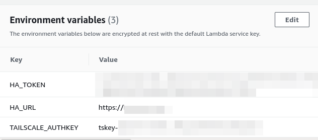

# Haaska with Tailscale

[Haaska](https://github.com/mike-grant/haaska/) shipped in a docker image with [Tailscale](https://tailscale.com/)

It allows to use Alexa Smart Home Skill without exposing your Home Assistant instance to the internet (except <a href="user-content-account-linking">during setup</a> )

If you fork this repo and setup **AWS_ACCESS_KEY_ID** and **AWS_SECRET_ACCESS_KEY** as Github encrypted secrets, a Github workflow will build and publish a docker image to your AWS ECR own account on eu-west-1 that you then can use for your "HomeAssistant-SmartHome" Lambda function

Currently it uses a fork of haaska in order to use environnment variables instead of the config.json for the home assistant url and token

**Requirement**: The [HA Tailscale Add-on](https://github.com/hassio-addons/addon-tailscale) installed and configured

The lambda function needs the 3 env vars:
- **HA_TOKEN**
- **HA_URL**
- **TAILSCALE_AUTHKEY** (see https://tailscale.com/kb/1113/aws-lambda/)



I advise to limit the concurrency of the Lambda function (e.g. "5") in order not to reach the Tailscale machine limit depending on your plan


## Account Linking

The only moment you need to expose your HA instance is during the setup when you do the [Account Linking part](https://www.home-assistant.io/integrations/alexa.smart_home/#account-linking),  (Right before the *Enable to use* part)

**However**, the token that your Alexa Skill will receive is only valid for **30 minutes** (see https://github.com/home-assistant/core/blob/master/homeassistant/auth/const.py#L4)

Dirty but working trick:
- update the code for the server to store and respond with a 10 year valid token
- restart HA
- update your DNS to point HA instance, forward 443 port from the internet to it
- do the Account Linking part
- revert code modifications, restart HA
- update your DNS to point to your **HA Tailscale IP**
- remove port 443 forwarding
- profit

Following is an example with Hass.io to get the 10 year token with ssh
```
docker exec -it homeassistant bash
sed -i  s/minutes=30/days=3650/   /usr/src/homeassistant/homeassistant/auth/const.py
exit
docker restart homeassistant
```


